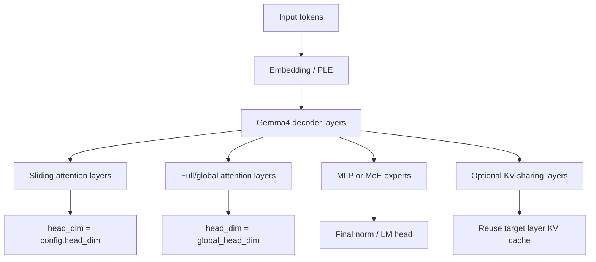

# Gemma4 在 vLLM Ascend 上的模型结构分析与适配方案设计

## 1. 背景与目标

Gemma4 是一类具有混合注意力结构、可选 KV-sharing 机制、MoE/Dense 多形态以及 MTP speculative decoding 能力的模型族。与传统同构 Transformer 模型相比，Gemma4 在注意力层类型、head dimension、KV cache 归属、图模式 replay 元数据以及量化算子路径上都存在更复杂的组合关系。

在 vLLM Ascend 上适配 Gemma4 的目标是：

1. 支持 Gemma4 Dense 与 MoE 模型在 Ascend A2、A3 和 A5 设备上的 eager 与 ACLGraph 推理。
2. 正确处理 Gemma4 交错注意力层，包括 sliding attention 与 full/global attention 的不同 head dimension 和不同 metadata 语义。
3. 支持 Gemma4 的 KV-sharing / YOCO 结构，保证 cache 写入、读取和 graph replay 的 layer 语义一致。
4. 在 A2/A3 与 A5 的算子能力差异下，选择最小、稳定、可维护的设备侧 fallback 策略。
5. 保持对已有模型路径的影响最小，尽量复用 vLLM 与 vLLM Ascend 主干已有能力。

本文从模型结构出发，说明 Gemma4 的关键特征、A2/A3 与 A5 的适配差异、图模式中容易出现的问题，以及最终采用的设计方案。

## 2. Gemma4 模型结构分析

### 2.1 整体结构

Gemma4 的主体仍然是 decoder-only Transformer 架构，但在 decoder layer 内部引入了几类重要变化：

- attention layer 不是完全同构，而是由 `sliding_attention` 与 `full_attention` 交错组成。
- sliding layer 和 full/global layer 可以使用不同的 head dimension。
- full/global layer 可能使用 `global_head_dim`，典型场景下可能达到 512。
- 部分模型启用 KV-sharing / YOCO 机制，后部层可以复用前部同类型层的 KV cache。
- MoE 版本将 FFN 部分替换为 routed experts，需要保证专家选择、token dispatch、通信路径和图模式 replay 一致。
- MTP draft 模型使用 Q-only attention，K/V 由 target model 的 KV cache 提供。

可以抽象为：



### 2.2 交错注意力层

Gemma4 的 `layer_types` 决定每一层是 sliding attention 还是 full attention：

- `sliding_attention` 使用局部窗口，通常 head dimension 较小。
- `full_attention` 使用全局注意力，可能使用 `global_head_dim`。

这意味着同一个模型内可能同时存在不同 shape 的 attention 算子。例如：

- sliding layer: `head_dim = 256`
- global layer: `head_dim = 512`

这对图模式尤其关键。图模式 capture/replay 过程中，如果只按 token shape 或字典顺序更新 attention metadata，可能会把 sliding layer 的 metadata 更新到 global layer 上，或者把 256 head layer 的 workspace 复用于 512 head layer，导致精度异常或运行时错误。

### 2.3 KV-sharing 与 YOCO

Gemma4 支持后部若干层复用前部层的 KV cache。模型侧通过 `kv_sharing_target_layer_name` 表达“当前 attention 层不拥有独立 KV cache，而是复用目标层的 KV cache”。

KV-sharing 带来的关键语义是：

- 当前层的计算仍然属于当前 layer。
- KV cache tensor 可能来自 target layer。
- graph replay metadata 必须使用当前 layer 的 metadata，而不能因为 cache 复用而切换到 target layer 的 metadata。

也就是说，KV-sharing 改变的是 cache ownership，不改变 attention metadata ownership。

这一点对 E2B/E4B 等带 KV-sharing 的 Gemma4 变体尤其重要。若 graph replay 以 target layer name 查 metadata，会把当前层语义错误地绑定到另一个层，导致图模式输出和 eager 不一致。

### 2.4 MoE 结构

Gemma4 MoE 版本在 FFN 部分引入专家路由。其推理路径需要保证：

- router logits 与 expert ids 的选择稳定。
- token 到 expert 的 dispatch 与 combine 顺序稳定。
- 图模式下 replay 阶段的通信语义与 eager 保持一致。
- 量化路径中 activation 与专家 MLP 使用模型真实配置，而不是假设固定激活函数。

MoE 模型对图模式更敏感，因为 attention、routing、expert dispatch 和通信路径会共同影响最终 logits。适配时需要避免将图模式优化建立在“单模型同构层”或“固定通信模式”的假设上。

### 2.5 MTP speculative decoding 结构

Gemma4 MTP draft model 与普通 draft model 不同。其 attention 是 Q-only：

- draft model 只产生 Q。
- K/V 不来自 draft 自己的 cache。
- K/V 由 target model 的对应层 cache 提供。

因此 Gemma4 MTP 需要额外处理：

- target 与 draft 的 KV cache 同步。
- per-group block table 路由。
- Q-only RoPE。
- draft attention 对 cross-model KV-sharing 的读取。

MTP 属于更高阶能力，适配时应尽量复用 vLLM 原生 `Gemma4Proposer` 的模型语义，只补充 Ascend 设备侧必要差异。

## 3. Ascend 设备能力差异

### 3.1 A5 设备特征

A5 对 Gemma4 的 attention 算子支持更完整，尤其是 FIA 路径对 global attention 的大 head dimension 支持更好。因此 A5 上的核心问题不是“是否支持 512 head”，而是：

- 图模式 replay 时如何正确区分 sliding/global layer。
- FIA workspace 如何覆盖不同 layer shape。
- PA 与 FIA 混合 capture 时如何保持 graph param 更新路径一致。
- KV-sharing layer 如何避免错误地使用 target layer metadata。

A5 的设计方向是：尽量保留高性能 FIA 路径，通过 layer-aware graph replay 和 workspace cache 设计保证正确性。

### 3.2 A2/A3 设备特征

A2/A3 上 FIA TND 对 Gemma4 global attention 的 `head_dim = 512` 支持有限。此时不能简单沿用普通 FIA 路径，否则可能出现启动失败、算子不支持或数值异常。

因此 A2/A3 的设计方向是：

- 对普通 head dimension 继续使用原 FIA 路径。
- 对 `head_dim = 512` 的 global layer 做设备侧 fallback。
- decode 阶段可以走 PagedAttention。
- prefill / chunked prefill 阶段使用 device adaptor 内封装的 large-head fallback，避免在 `attention_v1.py` 中写大量设备分支。

核心原则是：attention 主流程不感知设备差异，设备差异由 `DeviceOperator` / device utils 封装。

## 4. 适配方案设计

### 4.1 Attention 图模式 replay 设计

Gemma4 的 sliding/global layer metadata 语义不同，不能只依赖 dict 顺序或简单 layer index 来更新 graph params。适配方案引入 layer-aware replay：

- graph capture 时记录当前 attention layer name。
- graph update 时按 layer name 从 `attn_metadata` 中取对应 metadata。
- 对 PA graph params 使用显式包装结构，标记其属于 PagedAttention 参数。
- 对 FIA graph params 保持原有参数更新方式，但在 Gemma4 场景使用 layer-aware metadata lookup。

这样可以避免以下问题：

- global layer 使用 sliding layer 的 mask/block table。
- KV-sharing layer 因 cache target name 而使用错误 metadata。
- PA/FIA 混合 graph params 在 replay update 阶段误判参数格式。

设计要点：

```text
capture 当前 layer:
    保存 current layer name

update graph params:
    if param is PagedAttentionGraphParam:
        使用 PA 参数格式更新
        使用 param.layer_name 定位 metadata
    else:
        使用 FIA 参数格式更新
        使用当前 layer name 定位 metadata
```

### 4.2 FIA workspace 管理

Gemma4 模型内存在不同 attention shape，尤其是 256 与 512 head dimension 混合时，同一个 graph size 下不同 layer 的 FIA workspace 需求可能不同。

如果只缓存第一次 capture 得到的 workspace，后续大 head layer 可能需要更大的 workspace，导致 replay 或 capture 阶段 workspace size 不足。

适配方案：

- 普通模型保持原有“首次 workspace 缓存”逻辑。
- Gemma4 这类混合 attention shape 模型启用最大 workspace 缓存。
- 对同一个 `num_tokens`，缓存已见到的最大 workspace。
- replay 时复用最大 workspace，保证覆盖所有 layer。

这样可以避免对所有模型引入额外开销，同时保证 Gemma4 混合层结构下的 graph replay 稳定。

### 4.3 A5 attention 适配方案

A5 上保留 FIA 主路径：

- full/global attention 使用 A5 支持的 FIA 能力。
- sliding attention 按原有 sliding window metadata 执行。
- 图模式下通过 layer-aware replay 保证 metadata 与 layer 对齐。
- workspace 使用 Gemma4 专属最大 workspace cache 策略。
- KV-sharing layer 使用当前 layer name 更新 graph metadata，不因 cache target 发生 metadata 重定向。

A5 的重点不是规避 FIA，而是保证 FIA 在图模式下拿到正确 metadata 和足够 workspace。

### 4.4 A2/A3 attention 适配方案

A2/A3 上的关键限制是 FIA TND 不支持 Gemma4 global attention 的 512 head。方案采用分阶段 fallback：

#### Decode 阶段

decode 阶段对 `head_dim = 512` 的 global layer 走 PagedAttention。

实现方式：

- `using_paged_attention(runtime_shape, vllm_config, head_size)` 接收 `head_size`。
- 当 `head_size == 512` 时，对 A2/A3 返回 PagedAttention 路径。
- A5 仍保持原有 FIA 路径。

#### Prefill / Chunked Prefill 阶段

prefill 阶段不能简单复用 decode PA，因为 prefill 的 query/KV 长度、mask 语义和 block table 使用方式不同。

适配方案是在 device adaptor 中封装 large-head fallback：

- `attention_v1.py` 仍调用 `DeviceOperator.npu_fused_infer_attention_score`。
- `DeviceOperator` 内部根据设备实现选择路径。
- 当遇到 `head_size == 512` 时，使用 `npu_large_head_prefill_attention`。
- 该函数将 paged KV cache gather 成 dense TND KV，再调用 `npu_fusion_attention` 完成 prefill attention。

这样做的好处是：

- attention 主流程改动小。
- 设备差异集中在 device 层。
- 普通模型和普通 head dimension 不受影响。
- 后续 A2/A3 FIA 支持 512 head 后，可以在 device 层移除 fallback。

### 4.5 KV-sharing cache 写入策略

对 KV-sharing layer，当前层复用 target layer 的 KV cache，因此当前层不应再次写 cache。否则可能把 dummy/current K/V 写入共享 cache，污染后续 attention。

适配方案：

- 当 `kv_sharing_target_layer_name is not None` 时，跳过 `reshape_and_cache`。
- 普通 attention layer 保持原有 cache 写入逻辑。
- C8/NZ 等量化 cache 写路径也遵循相同规则。

该策略保证：

- cache ownership 与 vLLM 模型语义一致。
- KV-sharing layer 只消费共享 cache，不覆盖共享 cache。
- Dense、MoE、量化路径语义统一。

### 4.6 KV-sharing graph metadata 策略

KV-sharing layer 的 cache 来自 target layer，但 metadata 必须来自当前 layer。

适配方案：

- graph replay 记录 current layer name。
- `_graph_metadata_layer_name()` 返回当前 layer name。
- 不使用 `kv_sharing_target_layer_name` 作为 metadata lookup key。

原因是：

- `kv_sharing_target_layer_name` 表示 cache owner。
- graph metadata 表示当前计算层的 attention mask、block table、seq lens 等执行语义。
- 两者是不同维度的语义，不能混用。

这一点是 Gemma4 E2B/E4B 等 KV-sharing 模型图模式正确性的核心。

### 4.7 MoE 图模式适配思路

Gemma4 MoE 版本除了 attention 以外，还需要保证 MoE 路径在 eager 与 graph 下语义一致。

设计重点包括：

- 专家选择逻辑与模型配置一致。
- 量化 MoE MLP 使用模型真实 activation。
- 图模式下专家 dispatch/combine 顺序稳定。
- 通信策略需要保证 graph replay 后 token 与 expert 的对应关系不变。

对于 MoE 图模式，适配原则是优先保持语义稳定，再逐步恢复性能优化。若融合通信算子在特定图模式下存在设备或 shape 约束，应使用可验证的稳定路径作为基线，再评估融合路径的性能收益。

### 4.8 MTP 适配思路

Gemma4 MTP 适配应建立在 vLLM 原生 Gemma4 MTP 语义之上：

- 复用 upstream `Gemma4Proposer` 对 draft model、per-group block table、KV-sharing target layer 的结构化处理。
- Ascend 侧只补充必要差异：
  - NPU graph/eager 上下文管理。
  - target KV cache 写入与 draft KV cache 读取之间的 event 同步。
  - Q-only RoPE。
  - cross-model KV-sharing 的 attention 读取路径。

MTP 的核心约束是：draft attention 的 K/V 来自 target cache，因此不能把它当成普通 draft model 处理。

## 5. 适配过程中关键问题与解决方案

### 5.1 问题一：A2/A3 512 head FIA 不支持

现象：

- Gemma4 global layer 使用 `head_dim = 512`。
- A2/A3 FIA TND 对该 head size 支持有限。
- 直接走 FIA 可能导致启动失败或算子运行异常。

解决方案：

- decode 阶段对 512 head 使用 PagedAttention。
- prefill 阶段在 device adaptor 中走 `npu_large_head_prefill_attention`。
- 普通 head size 保持原 FIA 路径。

收益：

- 避免在 attention 主流程写设备判断。
- 保持 A5 高性能路径不受影响。
- 后续算子能力增强后可以低成本移除 fallback。

### 5.2 问题二：A5 图模式 workspace 不足

现象：

- 同一 graph size 下，Gemma4 不同 layer 的 FIA workspace 需求不同。
- 先 capture 到小 head layer workspace，后续 global layer 可能 workspace 不足。

解决方案：

- 对 Gemma4 启用最大 workspace 缓存策略。
- 同一 `num_tokens` 下记录最大 workspace。
- replay 时使用可覆盖所有 layer 的 workspace。

收益：

- 保持普通模型 workspace 缓存逻辑不变。
- 仅对混合 attention shape 模型启用增强逻辑。

### 5.3 问题三：图模式 metadata 与 layer 不匹配

现象：

- Gemma4 交错层中 sliding/global metadata 不同。
- 如果 replay 阶段按错误顺序或错误 layer key 更新 metadata，会导致精度异常。

解决方案：

- capture 时记录当前 layer name。
- update 时按 layer name 查找 metadata。
- PA/FIA 混合 graph param 使用显式 param wrapper 区分。

收益：

- 不依赖 dict 遍历顺序。
- 不依赖简单 layer index。
- 能处理 speculative decoding 或复杂调度下 attn key 顺序变化。

### 5.4 问题四：KV-sharing layer 使用了 target metadata

现象：

- KV-sharing layer 复用 target layer cache。
- 若 graph replay 误用 `kv_sharing_target_layer_name` 查 metadata，会把当前 layer 的执行语义替换为 target layer 的执行语义。

解决方案：

- cache target 与 metadata target 分离。
- metadata lookup 始终使用当前 layer name。
- cache tensor 复用仍按 `kv_sharing_target_layer_name` 执行。

收益：

- 保持 vLLM KV-sharing 模型语义。
- 修复 E2B/E4B 等 KV-sharing 模型图模式输出异常。

### 5.5 问题五：KV-sharing layer 错误写 cache

现象：

- KV-sharing layer 没有独立 cache ownership。
- 如果仍执行 `reshape_and_cache`，可能覆盖共享 cache。

解决方案：

- 对 `kv_sharing_target_layer_name is not None` 的层跳过 cache 写入。
- 普通 layer 和 producer layer 仍按原逻辑写入。

收益：

- 避免共享 cache 被 dummy/current K/V 污染。
- eager 与 graph 模式 cache 语义一致。

### 5.6 问题六：MoE 图模式语义稳定性

现象：

- MoE 模型图模式下 routing、expert dispatch、通信策略与 eager 有更高一致性要求。
- 融合通信路径若在图模式下存在 shape 或同步约束，可能放大为最终 logits 差异。

解决方案：

- 建立 eager 与 graph 的逐步对齐验证。
- 优先验证 routing ids、expert tokens、expert output combine 的一致性。
- 对通信策略建立稳定基线，再评估融合优化。
- 量化路径确保 activation 与模型配置一致。

收益：

- 将 MoE 问题拆解为 routing、expert、communication、logits 四个层次。
- 能更快定位图模式差异来源。

### 5.7 问题七：MTP Q-only attention

现象：

- Gemma4 MTP draft layer 只生成 Q。
- 普通 attention 路径假设 Q/K/V 同源，不适合直接处理 Q-only 场景。

解决方案：

- 复用 upstream Gemma4 MTP 的 proposer 语义。
- Ascend 侧补充 Q-only RoPE。
- draft 读取 target KV cache 前等待 target cache 写入完成。
- 按 per-group block table 读取正确 KV cache。

收益：

- 保持 Gemma4 MTP 原生语义。
- 避免将 MTP 特殊逻辑扩散到普通 spec decode 路径。

## 6. 文件级设计边界

为了保证代码可维护，建议按照以下边界组织实现。

### 6.1 `attention_v1.py`

职责：

- 保持 attention 主流程。
- 只保留必要的薄调用点。
- 不直接写复杂设备判断。

不建议：

- 在该文件中堆叠大量 Gemma4 专属逻辑。
- 在该文件中直接区分 A2/A3/A5 设备细节。

### 6.2 `attention/utils.py`

职责：

- 放置 graph replay、workspace cache、PA graph param update 等 attention 通用工具。
- 放置与 attention metadata 相关的轻量判断。

要求：

- 工具函数应少而清晰。
- 避免把模型专属大逻辑放成通用工具。

### 6.3 `device/device_op.py` 与 `device/utils.py`

职责：

- 封装设备差异。
- 对 A2/A3 512 head fallback 做设备侧实现。
- 提供 paged KV to dense TND 的基础工具。

优势：

- attention 主流程不感知设备差异。
- A5、A2/A3 后续能力变化可以在 device 层收敛。

### 6.4 `spec_decode/gemma4_proposer.py`

职责：

- 仅处理 Gemma4 MTP 在 Ascend 上的必要差异。
- 尽量复用 vLLM 原生 `Gemma4Proposer`。
- 不复制 upstream 已有逻辑。

### 6.5 `ops/rotary_embedding.py`

职责：

- 保持通用 RoPE 路径。
- 对 Q-only RoPE 做最小处理。
- 对大 rotary dim 的 UB 约束使用清晰常量和注释。

## 7. 验证方案

Gemma4 适配建议按以下层次验证。

### 7.1 启动与基础推理

- A2/A3 eager 启动。
- A2/A3 ACLGraph 启动。
- A5 eager 启动。
- A5 ACLGraph 启动。
- Dense 与 MoE 分别验证。
- BF16 与 W8A8 量化分别验证。

### 7.2 attention 路径验证

- sliding attention layer 与 global attention layer 分别覆盖。
- `head_dim = 256` 与 `head_dim = 512` 分别覆盖。
- prefill、chunked prefill、decode 分别覆盖。
- PA/FIA 混合 graph param update 覆盖。
- graph replay metadata 按 layer name 更新。

### 7.3 KV-sharing 验证

- KV-sharing layer 不写 cache。
- KV-sharing layer 使用当前 layer metadata。
- 当前 layer cache read 指向 target cache tensor。
- Eager 与 ACLGraph 输出一致。

### 7.4 MoE 验证

- router top-k ids 一致。
- expert token count 一致。
- expert dispatch/combine 一致。
- logits top-k 与最终答案一致性验证。
- eager 与 graph 精度对齐。

### 7.5 MTP 验证

- draft model 启动。
- Q-only RoPE 输出 shape 与 dtype 一致。
- target KV write 与 draft KV read 同步。
- per-group block table 路由正确。
- acceptance rate 与 eager/参考路径对齐。

## 8. 设计原则总结

Gemma4 在 Ascend 上的适配不是单一算子替换，而是模型结构、设备能力和图模式 replay 语义共同作用的系统工程。

最终设计遵循以下原则：

1. 设备差异收敛到 device adaptor，attention 主流程保持简洁。
2. 图模式 replay 必须以 layer 语义为准，而不是以 cache owner 或遍历顺序为准。
3. KV-sharing 中 cache ownership 与 metadata ownership 必须分离。
4. A5 优先保留 FIA 高性能路径，通过 replay 与 workspace 管理保证正确性。
5. A2/A3 对 512 head 做最小 fallback，普通路径不受影响。
6. MoE 与 MTP 适配优先保证语义一致，再逐步优化性能。
7. 尽量复用 vLLM 和 vLLM Ascend 主干已有能力，避免重复实现。

通过以上设计，Gemma4 Dense、MoE、KV-sharing 与 MTP 等结构可以在 Ascend A2、A3 和 A5 上形成统一、可维护、可扩展的适配框架。
